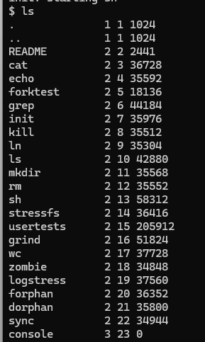

# Instalación de xv6 sobre Ubuntu (WSL)

## 4.1. Verificación de la versión de Ubuntu

### Parte A: Confirmar la versión instalada
Dentro de la terminal de Ubuntu, ejecutar:

```bash
lsb_release -a
```

Se requiere **Ubuntu 24.04** o superior. Versiones anteriores pueden instalar, mediante `apt`, una versión de QEMU insuficientemente reciente para este laboratorio.

> ⚠️ **Atención:** Si la versión es menor a 24.04, ejecutar `sudo apt update && sudo apt full-upgrade`, o reinstalar la distribución siguiendo nuevamente la Sección 4.3 del Laboratorio 01 (`wsl install -d Ubuntu` instala, por defecto, la versión más reciente disponible).

---

## 4.2. Instalación de las herramientas RISC-V y QEMU

### Parte A: Actualizar el repositorio de paquetes
```bash
sudo apt update && sudo apt upgrade
```

### Parte B: Instalar las herramientas necesarias
```bash
sudo apt install git build-essential gdb-multiarch qemu-system-misc qemu-system-riscv gcc-riscv64-linux-gnu binutils-riscv64-linux-gnu
```

> ℹ️ *Esta instalación puede tardar varios minutos, dependiendo de la velocidad de conexión a internet.*

### Parte C: Verificar la instalación
```bash
riscv64-linux-gnu-gcc --version
qemu-system-riscv64 --version
```
# Ejecución del comando `ls` en xv6

El comando `ls` se utiliza para listar los archivos y directorios del sistema de archivos actual. Una ejecución correcta en el shell de xv6 genera una salida estructurada en cuatro columnas con el siguiente formato:

```text
[Nombre] [Tipo] [Inodo] [Tamaño]
```

## Estructura de la Salida

* **Nombre del archivo / directorio:** Primera columna. Muestra el identificador del elemento en el directorio actual (por ejemplo: `.`, `..`, `README`, `cat`, `ls`).
* **Tipo de archivo:** Segunda columna. Representa la naturaleza del archivo mediante un identificador numérico entero:
  * `1` (T_DIR): Directorio.
  * `2` (T_FILE): Archivo regular o ejecutable.
  * `3` (T_DEV): Dispositivo especial (como `console`).
* **Número de Inodo:** Tercera columna. Muestra el identificador único del nodo de índice (`inode`) asignado al archivo dentro del sistema de archivos de xv6.
* **Tamaño:** Cuarta columna. Indica el tamaño del archivo expresado en **bytes**. Los archivos de tipo dispositivo (`3`) suelen mostrar un tamaño de `0`.

## Ejemplo de Salida Correcta

Al ejecutar `$ ls` en el directorio raíz, deberías observar una estructura similar a la siguiente:

```text
.              1 1 1024
..             1 1 1024
README         2 2 2441
cat            2 3 36728
ls             2 10 42880
console        3 23 0
```


